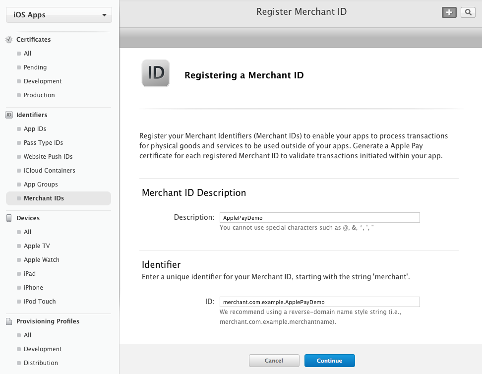
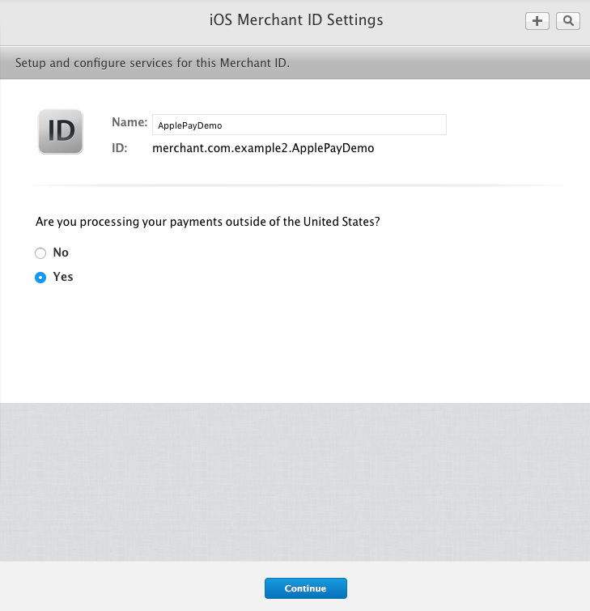
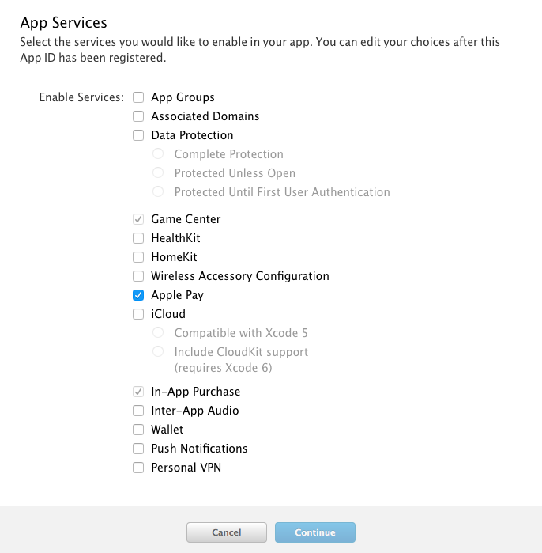
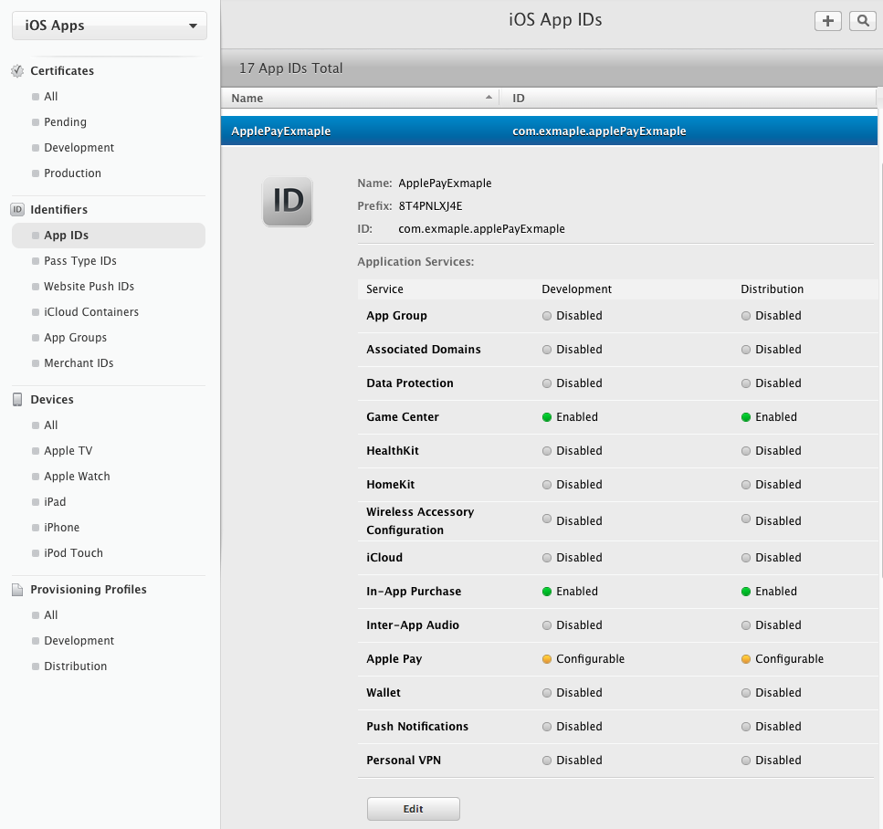
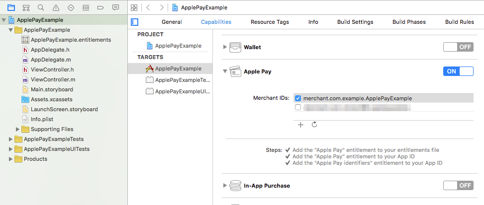

## 概览

* [配置](#配置)
* [开发](#开发)

## 配置

### 注册 Merchant ID
使用 Apple Pay 的前提是必须注册一个 `Merchant ID`

1. 在开发者后台选择 [Merchant IDs 标签](https://developer.apple.com/account/ios/identifiers/merchant/merchantCreate.action) ，设置你的 `Merchant ID`，注册系统会默认添加 `merchant.` 前缀，如下图  

2. 注册完成后再次选择 [Merchant IDs 标签](https://developer.apple.com/account/ios/identifiers/merchant/merchantList.action)，在列表中点击 `ApplePayDemo`，点击 `Edit`

3. 由于我们是在中国区使用 `Apple Pay`，所以在 `Merchant Settings` 的 `Are you processing your payments outside of the United States?` 选项中勾选 `Yes`  

4. 继续生成 `CSR`，这一步跟 `APNS` 的 `CSR` 生成步骤是一样的，不再赘述，请大家参考相关资料

### 注册 App ID

1. 在开发者后台选择 [App IDs 标签](https://developer.apple.com/account/ios/identifiers/) 注册 `App ID` 并指定 `Bundle ID`，例如 `com.example.appid`，在 `App Services` 中记得勾选 `Apple Pay`  

2. 注册完成再次选择 [App IDs 标签](https://developer.apple.com/account/ios/identifiers/)，点击刚才所注册的 `App ID`，点击 `Edit` 按钮  

3. 在 `Apple Pay` 中点击 `Edit`，然后选择你刚才生成的 `Merchant ID`  

### 生成 `Provisioning Profile` 并配置 Xcode 项目

1. 在开发者后台选择 [Provisioning Profiles 标签](https://developer.apple.com/account/ios/profile/profileList.action) ，根据刚才的 `App ID` 生成 `Profile`，完成后下载文件，双击文件完成导入

2. 创建 Xcode 项目，设置相应的 `Bundle ID`。完成后在项目的 `TARGETS` 项中选择 `Capabilities` 标签，打开 `Apple Pay` 选项并配置相应的 `Merchant ID`  

## 开发
